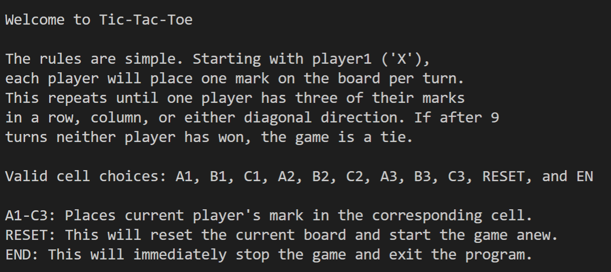
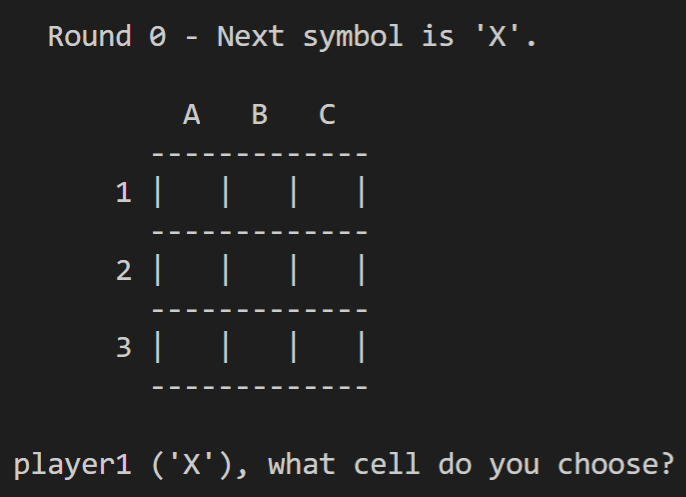
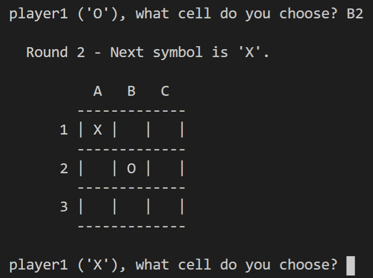

# TicTacToe

I completed this project during a Python course as a part of the Masters of Science in Analytics program at NC State. Since I had been using Python for many years at this point, I used the assigned to work on class usage.

It is a simple script designed to be ran at the command prompt, and all gameplay features are used through text inputs once the
game is running.

---

# screenshots

#### tutorial text that prints when the game begins

#### a fresh game board 

#### taking turns

